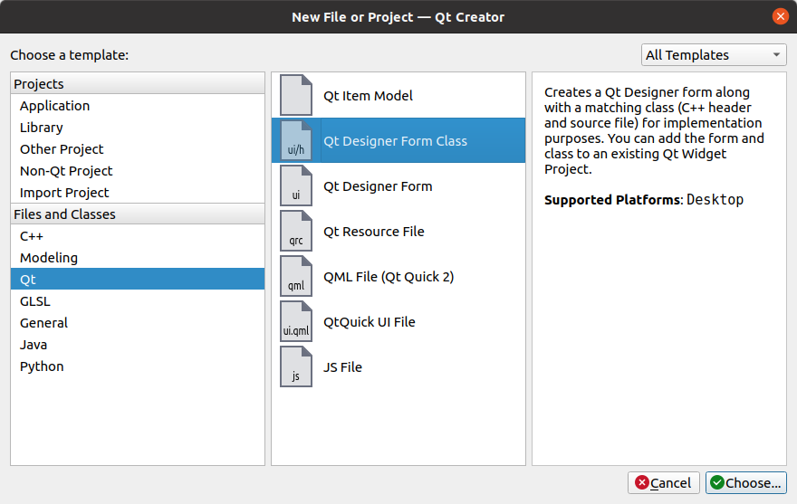
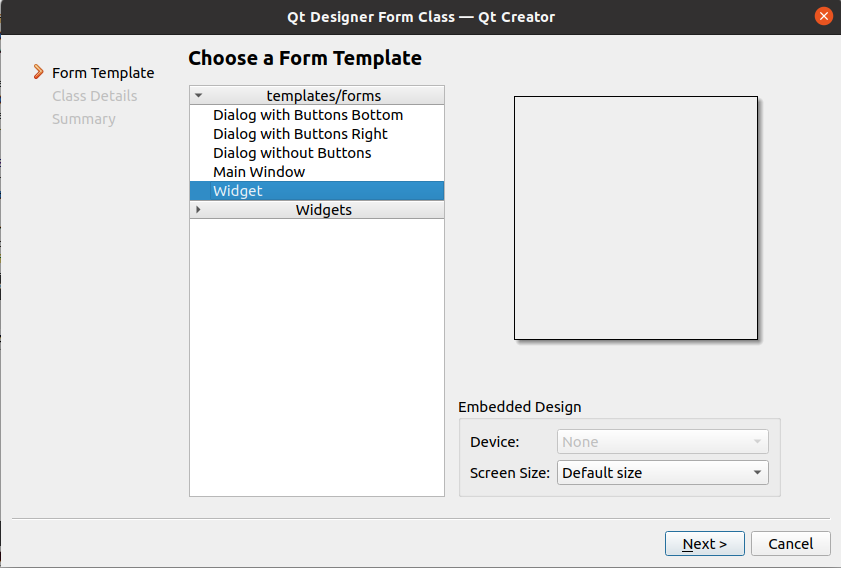
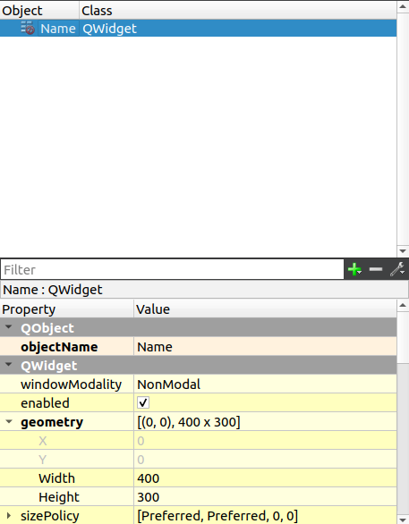
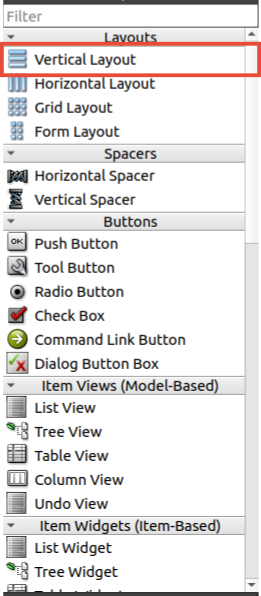
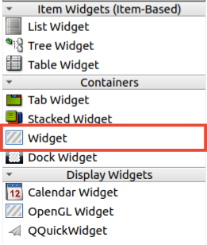
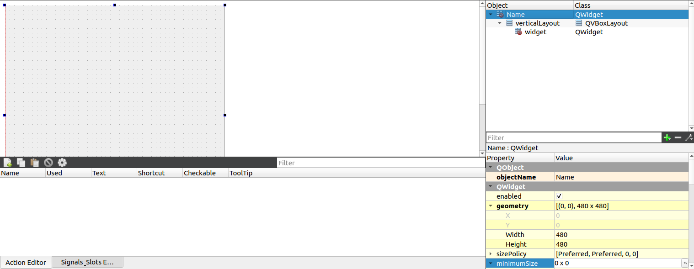

# Tutorial on how to Create QT widget for aerospace village badge

## Install QT Creator and QT5
```
sudo apt-get update
sudo apt install qtcreator
```
and
```
sudo apt install qt5-default
```
or if that's not available:
```
sudo apt install qtbase5-dev qt5-qmake clang g++
```

also install https://build.opensuse.org/projects/home:tumic:QtPBFImagePlugin/packages/QtPBFImagePlugin/repositories/Debian_12/binaries


https://wiki.qt.io/Install_Qt_5_on_Ubuntu#:~:text=Open%20a%20terminal.%20Type%20the%20following%20command%20and,apt-get%20install%20qt5-default%20Qt%205.x%20will%20be%20installed.

## Open QTCreator
Open project


## Make a new widget
The easiest way is to got to File->New File (or Project)...  
Select QT-> QT Designer Form Class
  
Select From Template Widget  
  
Set a **Name** then Next  
*This will generate the **.h, .cpp, .ui** in the correct location*

## In QTCreator go to the Class Name .ui file you just made 
On the right click the Object name  
then on the bottom right Select the geometry *click the arrow next to it* set it width=480, height=480
  
Add in a Vertical layout **make the box match the dimensions of the view**  
  
Then add a widget  
  
At the end it should look like this  
    
## Static image display GUI
in the property (bottom right) for the widget filter for Pixmap select the second option and pic the image you want to show


## In MainWindow.cpp
The Constructor we stack the widget and add them one at a time 
```
MainWindow::MainWindow(QWidget *parent)
    : QMainWindow(parent)
    , ui(new Ui::MainWindow)
    
ui->verticalStackedWidget->addWidget(widget1);
ui->verticalStackedWidget->addWidget(widget2);
... 


```

Detects Key presses  
in the example if X is pressed show widget1
```
void MainWindow::keyPressEvent( QKeyEvent* event ) 
switch ( event->key() ) {
    case Qt::Key_X:
        ui->verticalStackedWidget->setCurrentWidget(widget1);
        break;

```

if you make a function on the cpp file like
```
void MainWindow::updateText()
```
use **Alt+Enter** for the IDE to add it to .h (set it to public or private class)


# Multiple Layer of Images: 
## Make a new widget
The easiest way is to got to File->New File or Project...  
Select QT-> QT Designer Form Class
  
Select From Template Widget  
  
Set a **Name** then Next  
*This will generate the **.h, .cpp, .ui** in the correct location*
for images add a QPainter

###.h file
``` 
#include <QPaintEvent>
#include <QImage>

in PUBLIC:
QPainter *painter;

```
###.cpp file
```
void <class Name>::paintEvent(QPaintEvent *pEvent){
	painter = new QPainter(this);
	
	QPen pen(Qt::red); // set color for pen
	painter->setPen(pen);
	pen.setWidth(5);
	painter->drawImage(point, QImage("<file address>")); // draw first
	painter->drawRect(100,100,200,200);  // draw after
	
}
```

## For Key input events
###.h file
```
#include <QKeyEvent>
in PUBLIC:
void keyPressEvent(QKeyEvent *event);
```

###.ccp
```
void <class Name>::keyPressEvent( QKeyEvent* event ){
	switch ( event->key() ) {
	    case Qt::Key_Up:// select key input
		update(); // update drawing QPainter
		break;
}
```

## For Mouse Wheel input events
###.h file
```
#include <QWheelEvent>
in PUBLIC:
void wheelEvent(QWheelEvent* event);
```

###.ccp
```
void <class Name>::wheelEvent(QWheelEvent* event){
    if(event->angleDelta().y() > 0){ // scroll wheel up 
        update(); /// update drawing QPainter
    } else if(event->angleDelta().y() < 0){  // scroll wheel down
        update();
    }
}
```


## Making Maps 
Pre setup .osm.pfb files use
tilemaker https://github.com/systemed/tilemaker

install steps https://github.com/systemed/tilemaker/blob/master/docs/INSTALL.md
install ***apt install Lua5.1*** in ubuntu then make

run  
``` ./tilemaker /path/to/.osm.pfb /path/to/.mbtiles ```
recommend add ```--store /tmp ``` if large file

can go to pbf files
``` ./tilemaker ../path/to/.osm.pbf ../path/to/folder/ --store /tmp/store```


#### To lay it out in a /z/x/y file format
git clone https://github.com/mapbox/mbutil \
cd mbutil \
```./mb-uitl --image_format=pbf /path/to/.mbiles /path/to/folder/``` to z/x/y.osm.pfb \
if python error and pyton installed run ```sudo ln -s /usr/bin/python3 /usr/bin/python```

Helpful Link for map Tiles:
https://www.reddit.com/r/openstreetmap/comments/yvdj9w/can_i_render_tiles_directly_from_osmpbf_data/

#### Helpful resource 
https://wiki.qt.io/Qt_for_Beginners

#### Modify Maps in RadarScope
```".local/share/<appName>", "/usr/local/share/<appName>", "/usr/share/<appName>", "/var/lib/snapd/desktop/<appName>"```
there is a /style/style.json you edit to make it look different

<appName> is the **Active Project** Name in QtCreator

we are using thi https://github.com/tumic0/QtPBFImagePlugin
so style guide is https://github.com/tumic0/QtPBFImagePlugin-styles


# QT Quick QML application - different than above

- qtlocation5-dev for /usr/include/x86_64-linux-gnu/qt5/QtLocation/QtLocation;
- qtpositioning5-dev for /usr/include/x86_64-linux-gnu/qt5/QtPositioning/QtPositioning.

Install them along with QML bindings with

sudo apt install qtlocation5-dev qtpositioning5-dev 
sudo apt install qml-module-qtlocation qml-module-qtpositioning


# Flashing Board
Download the winglet-os.img.gz
Choose either the RPI Imager or Balena Etcher:

**EITHER**\
Install the RPI Imager from https://www.raspberrypi.com/software/
Plug In board to USB-C and Hold the B button should say USB Recovery Mode on the Screen 
Now in the RPI Installer Select the winglet-os.img.gz file and flash it to the USB device\
For Device:No Filter\
For OS: Use Custom (select the winglet-os.img.gz)\
Select Next\
**OR**\
Etcher https://etcher.balena.io/ \
Select Device\
Select winglet-os.img.gz file\
Select Flash

Wait for system to say done (may press the restart button on the Badge for the update to take place)


# Debug 
### You can debug form QTCreator/Device SSH/Device Debug Options
SSH root 192.168.100.1 through USB-C NO PWD
